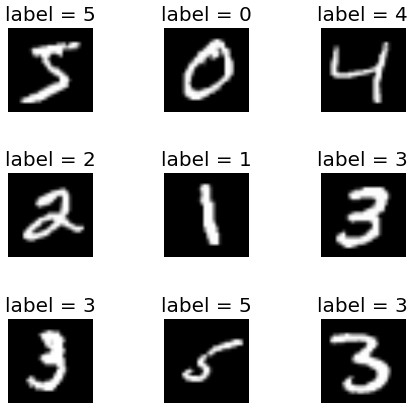

# AI-Homework

## 과제 개요   
* Fully-connected 인공 신경망을 이용한 MNIST(손 글씨 이미지) 영상 분류하기
   

* 과제 목표 : 하이퍼파라미터에 따른 인공 신경망의 성능 분석
  
* 수행 작업   
  * 베이스 모델의 epoch(학습 주기) 변경
  * 베이스 모델의 hidden layer(은닉 계층)수 변경
  * 베이스 모델의 hidden neuron(은닉 뉴런)수 변경
  
- - -
## 수행 작업 설명
### 1.베이스 모델의 epoch(학습 주기) 변경    
* 작업 내용   
  * 3개의 파일 중 하나를 선택한 후 EPOCHS 값을 50, 100, 200, 400으로 각각 변경하여 학습 및 실험
 
* 결과물   
  * Epoch에 따른 성능 비교
  * 결과에 대한 분석 및 평가

### 2.베이스 모델의 hidden layer(은닉 계층)수 변경   
* 작업 내용   
  * hidden layer 값을 1,2,3으로 각각 변경하여 학습 및 실험
 
* 결과물   
  * hidden layer 값에 따른 성능 비교
  * 결과에 대한 분석 및 평가
 
### 3.베이스 모델의 hidden neuron(은닉 뉴런)수 변경  
* 작업 내용   
  * mnist_V2_two_layers.py와 mnist_V3_three_layers.py파일의 N_HIDDEN = 64, 128, 256로 각각 변경하여 학습 및 실험 
 
* 결과물   
  * Hidden neuron수에 따른 성능 비교
  * 결과에 대한 분석 및 평가
     
  
- - -
### 부록 1) 손글씨 데이터 집합 MNIST

* 데이터 분할 및 크기
  * Train data# : 60,000개
  * Test data# : 10,000개
  
* 입력 데이터
  * 흑백 영상
  * shape : 28x28

* 출력 데이터
  * 영상 라벨 {0 ~9}

* 코드 첫 실행 시, 자동으로 다운로드

### 부록 2) 참고 사이트
* Keras참고
  * https://keras.io/api/
  
* Tensorflow 참고 (2.3버전)
  * https://www.tensorflow.org/versions/r2.3/api_docs/python/tf?hl=ko

